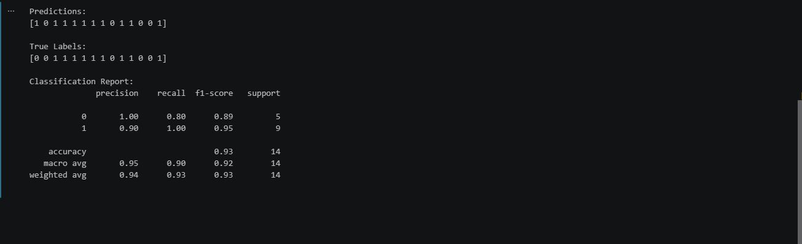

# Naive Bayes (From Scratch)

A simple implementation of the **Categorical Naive Bayes** algorithm using only **Pandas** and **NumPy**, without machine learning libraries.

## Features

- Categorical Naive Bayes from scratch.
- Laplace Smoothing.
- Prediction on new samples.
- Evaluation using Accuracy, Confusion Matrix, and Classification Report.

## Results

### My Implementation


### Scikit-learn Implementation



## Run

```bash
python main.py
```

## Requirements

- pandas
- numpy
- scikit-learn *(used only for evaluation)*